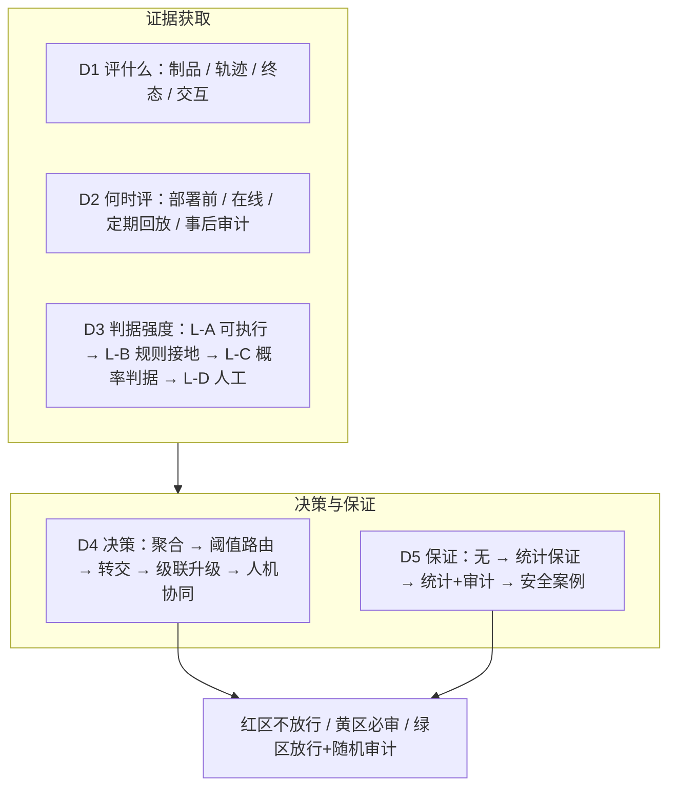

# Agent 结果在线评价与人工升级（Online Result Evaluation & Human Escalation）：Survey 写作骨架与文献分类

> 配套事实底座：[`agent-online-eval-hitl-research.md`](agent-online-eval-hitl-research.md)（13 章 + 附录，含全部一手证据与 arXiv 编号）。
> 配套工具：[`online-eval-calculator.html`](online-eval-calculator.html)（阈值、审计样本量、成本曲线计算器）。
> 本文用途：把调研结果转成一篇 survey 的可执行写作计划——标题、论点、章节、分类体系、空白表、图表清单与证据核对表。

---

## 1. 定位：这篇 survey 要填哪个格子

现有综述已经把"agent 评测"的地图画出主干：

| 已有综述 | 它切分的维度 | 留下的空格 |
| --- | --- | --- |
| 2507.21504 *Evaluation and Benchmarking of LLM Agents: A Survey* | 二维：**评什么**（行为/能力/可靠性/安全）× **怎么评**（交互模式/数据集/指标计算/工具） | "指标怎么变成**在线决策与保证**"只占几行 |
| 2411.15594 *A Survey on LLM-as-a-Judge* | judge 的方法、偏置、可靠性、标准化 | 未展开"judge 与人工队列的联合系统" |
| 2606.04990 *From Agent Traces to Trust* | 证据追溯与执行出处（process-level accountability） | 未展开"证据如何驱动放行/升级决策与统计保证" |
| 2603.04445 *Dynamic Model Routing and Cascading* | 路由与级联的效率视角 | 未处理"级联到**人**"这一档 |

**本文的 thesis（一句话）**：
> 当 agent 结果必须被承诺时，评测研究的核心对象应从"**如何打分**"迁移到"**如何用分数做可辩护的放行决策**"——即把选择性预测、conformal 风险控制、learning-to-defer 与在线评测工程、人工队列运营、审计统计结合起来，回答"覆盖率—残余错误率—人工成本"的三方权衡。

### 1.1 标题候选
| # | 标题 | 侧重 |
| --- | --- | --- |
| A | *From Scores to Decisions: A Survey of Online Result Evaluation and Human Escalation for LLM Agents* | 最贴合本文主线（推荐） |
| B | *Zero Unvetted Release: Assuring Agent Results via Selective Evaluation and Human Escalation* | 突出"可承诺目标"的重构 |
| C | *Coverage, Residual Risk, and Human Cost: A Survey of Post-Deployment Evaluation for LLM Agents* | 突出三方权衡与度量 |

### 1.2 四条核心论点（全文的"承重墙"）
1. **目标重构**：把"结果准确率"从点估计改成三元组承诺（复核覆盖率 100% / 残余错误率 ≤ α / 强判据覆盖率 ≥ v）。
2. **判据强度阶梯**：可执行验证 → 规则与接地 → 概率判据 → 人工；judge 只应承担"不可执行"的语义维度，且必须被校准与监控。
3. **决策要有保证**：阈值应由校准集分位数给出（conformal / risk control），转交应有容量与疲劳约束（learning-to-defer），并监控分布泄漏。
4. **保证必须可审计**：残余错误率只能由**随机审计**估计；保证有作用域、会过期，需要漂移监控与自动收紧（fail-closed 退化）。

---

## 2. 章节骨架

> 每节给出：**目标 / 必备内容 / 关键文献 / 图表**。预计正文 12–18 页（Elsevier 双栏）或 30–40 页（arXiv 预印本风格）。

### 摘要（250 词）
结构：问题（agent 结果无法承诺）→ 现有综述的缺口（评分 ≠ 决策）→ 本文分类的五维（§3）→ 主要发现（judge 可靠性上限、静默故障、审计算术）→ 开放问题。

### §1 Introduction
- 用三个真实场景引入：客服自动回复、金融操作 agent、代码 agent 提交 PR——共同点是"对外交付前必须有可辩护的放行依据"。
- 明确"100% 准确"为何不可承诺（三条硬理由：判据不可靠 / 漂移与 OOD / 攻击面）。
- 提出目标重构（三元组承诺）与本文贡献列表（5 条）。
- **贡献列表（建议写法）**：
  1. 首次提出"零未复核出厂"的形式化目标与三元组度量；
  2. 提出判据强度阶梯与可验证性分级（V1–V4）；
  3. 建立五维分类体系（§3）并系统定位 150+ 篇文献与 12 类产品；
  4. 系统梳理"保证"工具链（conformal / risk control / L2D / 安全案例）与工程落地的接口；
  5. 给出 8 项研究空白与可执行的受控实验设计（含基准建议）。

### §2 Background and Problem Formulation
- 2.1 agent 结果的三种形态（制品 / 轨迹 / 业务终态）与"结果"的定义问题〔2606.04990〕。
- 2.2 在线 vs 离线评测的目标差异（在线无参考答案）〔LangSmith evaluation concepts〕。
- 2.3 形式化定义：覆盖率 c、风险 R(c)、残余错误率、审计预算、转交率 ρ、人工容量、疲劳函数。
- 2.4 威胁模型：判据被注入绕过〔2510.09462〕、被评对象的 specification gaming、评审人的自动化偏见〔2411.00998〕。
- **图表**：Fig.1 术语与符号表；Fig.2 "问题定义"示意（红/黄/绿三区 + 三条旁路）。

### §3 Taxonomy（本文的骨干贡献）
五个正交维度，每个维度给出取值与代表性工作（详见 §4 的图与表）：
- **D1 评什么（Object）**：制品 / 轨迹 / 终态 / 交互过程
- **D2 何时评（Timing）**：部署前 / 在线实时 / 定期回放 / 事后审计
- **D3 判据强度（Evidence）**：L-A 形式化与可执行 / L-B 规则与接地 / L-C 概率判据 / L-D 人工
- **D4 决策机制（Decision）**：打分聚合 / 阈值路由 / 转交（defer） / 级联升级 / 人机协同
- **D5 保证强度（Assurance）**：无保证 / 统计保证 / 统计 + 随机审计 / 安全案例与合规证据

### §4 Related Work（按 D1–D5 组织，避免按时间罗列）
每组末尾给出"该组解决了什么 / 未解决什么"的两句小结（供 §7 汇总成空白表）。

### §5 Judge Reliability（对应 D3，本文的"恐惧清单"）
- 一致性（翻转率 13.6%〔2606.13685〕、κ 与 exact match 差 33–41pp〔2606.19544〕）
- 偏置分类（位置 / 长度 / 自偏好 / rubric 顺序 / score ID / 参考答案〔2506.22316〕）
- 校准与估计量偏差〔2605.06939〕、rubric 工程〔2602.05125、2601.08654、2605.30803〕
- 过优化与 benchmark 相关性弱〔2310.02743、2505.12763〕
- **图表**：Table 偏置类型 × 缓解手段 × 证据；Fig.3 judge 四项 SLO 与监控点

### §6 From Scores to Decisions（对应 D4+D5）
- 6.1 风险-覆盖曲线与不可靠弃权的反例〔2603.15574〕
- 6.2 conformal 家族：risk control〔2208.02814〕、selective risk control〔2512.12844〕、API-only〔2403.01216〕、漂移感知〔2510.05566〕、自适应〔2604.13991〕
- 6.3 选择性评估与人类一致性保证〔2407.18370〕（含级联选择性评估）
- 6.4 learning-to-defer：容量与成本〔2403.06906〕、免训练〔2509.12573〕、疲劳〔2604.00904〕、转交偏置〔2608.28050〕、少样本专家〔2304.07306〕
- 6.5 三区间 + 双保险策略与成本最优 ρ〔本文贡献，可配 calculator〕
- **图表**：Fig.4 决策谱系（从打分到安全案例）；Fig.5 风险-覆盖-成本三维曲面示意

### §7 Human Escalation as an Operations System（对应 D3-LD 与 D4-defer）
- 7.1 触发矩阵（高危 / 不可逆 / 不确定 / 冷启动 / OOD / 用户信号 / 随机审计 / 金标）
- 7.2 队列机制综述（LangSmith / Langfuse / Braintrust / Opik / Giskard / Label Studio / Argilla）
- 7.3 评审人可靠性：盲评、金标、IAA、仲裁、疲劳与容量
- 7.4 从审查到数据（修正稿 → 数据集 → 回归）
- **图表**：Table 产品能力对照（含 blind review、reservation、条件显示等"值得抄的细节"）

### §8 Assurance, Auditing and Compliance（对应 D5）
- 8.1 审计算术：rule of three、Wilson / Clopper-Pearson、检出样本量、分层与顺序审计
- 8.2 作用域声明模板与"保证会过期"（漂移、重校准、自动收紧）
- 8.3 安全案例结构（claim–argument–evidence）与 AMLAS/SOTIF 传统的迁移
- 8.4 法规映射：EU AI Act 14/15、NIST AI RMF、中国《暂行办法》第八条与标识办法
- **图表**：Table α × 样本量 × 成本；Fig.6 审计闭环与失效路径

### §9 Open Problems（见 §5 的空白表）
每项给出：问题陈述 / 为什么现在能解 / 需要什么实验或数据 / 评价指标。

### §10 Conclusion
回到 thesis：评测的下一站是"可辩护的决策"。

### 附录
- A 术语表（中英对照）
- B 数据集与基准清单（tau2-bench、TRAJECT-Bench、ATLAS、以及 trajectory-judge 的确定性工具环境 + 故障注入设计）
- C 产品与开源对照表
- D 复现脚本与数据快照（指向本仓库的 research/ 脚本）

---

## 3. Related Work 分类体系（五维）

### 3.1 总图（ASCII 版，可直接改绘为 Fig.3）

```
                          ┌──────────────────────────────────────────────┐
                          │   D5 保证强度 Assurance                       │
                          │   A0 无（仅点估计）→ A1 统计保证 →            │
                          │   A2 统计保证 + 随机审计 → A3 安全案例/合规证据 │
                          └──────────────────────────────────────────────┘
                                             ▲
┌───────────────────────────┐   ┌───────────────────────────┐   ┌───────────────────────────┐
│ D1 评什么 Object           │   │ D2 何时评 Timing           │   │ D3 判据强度 Evidence       │
│ O1 制品（代码/文档/SQL）    │   │ T1 部署前（离线/CI）        │   │ E-A 形式化与可执行验证      │
│ O2 轨迹（工具/顺序/参数）   │   │ T2 在线实时（采样/全量）    │   │ E-B 规则与接地（引用/策略） │
│ O3 终态（DB/工单/文件/付款）│   │ T3 定期回放（金标集/探针）  │   │ E-C 概率判据（judge/RM）    │
│ O4 交互过程（多轮/会话）    │   │ T4 事后审计（随机抽样）     │   │ E-D 人工复核                │
└───────────────────────────┘   └───────────────────────────┘   └───────────────────────────┘
                                             ▼
                          ┌──────────────────────────────────────────────┐
                          │   D4 决策机制 Decision                        │
                          │   M1 打分聚合 → M2 阈值路由（选择性预测）      │
                          │   → M3 转交（learning-to-defer）              │
                          │   → M4 级联升级（便宜→贵→人）→ M5 人机协同     │
                          └──────────────────────────────────────────────┘
                                  产物：红区 / 黄区 / 绿区 + 三条旁路
```

读法：**D1/D2/D3 决定"拿到什么证据"，D4 决定"怎么处置"，D5 决定"能不能对外承诺"。** 现有文献密集在左侧三列，稀疏在 D5，这也是本文的主要缺口来源。

### 3.2 同一分类的 mermaid 版（便于渲染进论文）



### 3.3 各维度的取值与代表性工作

**D1 评什么**
| 取值 | 代表性工作 / 产品 | 关键结论 |
| --- | --- | --- |
| 制品 | 计算型指标与 rubric 评测（Vertex Gen AI evaluation service 的 computation-based metrics） | 最易自动化，但无法覆盖过程错误 |
| 轨迹 | TRAJECT-Bench〔2510.04550〕、ATLAS〔2608.30685〕、trajectory-judge〔2609.00038〕 | outcome-only judge 对静默故障仅 45% 召回 |
| 终态 | 可执行验证、状态回读、形式化验证（Bedrock Automated Reasoning） | 证据最强，但作用域受策略变量限制 |
| 交互 | 多轮/会话级评测（LangSmith multi-turn online evaluators） | 单轮指标会漏掉跨轮遗忘与上下文漂移 |

**D2 何时评**
| 取值 | 代表性工作 / 产品 | 关键结论 |
| --- | --- | --- |
| T1 部署前 | 离线数据集评测（LangSmith/Langfuse/Braintrust 的 experiments） | 与在线分布脱节 |
| T2 在线实时 | LangSmith online evaluators（filter + sampling rate）、Langfuse Observation 级在线评测（trace 级已弃用）、Azure 连续评测（按采样率）、Weave Signals（13 个内置信号） | 已商品化；采样率与花费上限是必备旋钮 |
| T3 定期回放 | 金标集回放、定时评测（Azure 定时评测、Giskard cron）、对抗探针 | 唯一能发现"静默退化"的形态 |
| T4 事后审计 | 随机审计（本文提出的双保险）、合规抽样核验 | 残余错误率的唯一可估计来源 |

**D3 判据强度**（本文提出的阶梯，建议作为论文的核心表之一）
| 级别 | 判据 | 证据强度 | 主要失效模式 | 代表 |
| --- | --- | --- | --- | --- |
| L-A | 编译/单测/schema/状态回读/幂等重放/形式化验证 | 最强（可给证明） | 只覆盖规则捕获的范围 | 可执行验证、Automated Reasoning |
| L-B | 引用命中、工具返回支撑、策略规则、小模型校验 | 强（可审计） | 规则可被贴标签绕过 | MiniCheck、Groundedness 检查 |
| L-C | LLM-as-judge、rubric、reward model | 弱（有偏、可漂移、可被注入） | 翻转 13.6%、κ 虚高 33–41pp、可注入绕过 | 2411.15594、2606.13685、2510.09462 |
| L-D | 人工复核 | 结论性（仍需被审计） | 锚定 / 橡皮图章 / 疲劳 | 2411.00998、2604.00904 |

**D4 决策机制**
| 取值 | 代表性工作 | 关键结论 |
| --- | --- | --- |
| M1 打分聚合 | 加权 rubric、多判据合流 | 平均分会吞掉高危项 → 需 veto 机制 |
| M2 阈值路由 | 选择性预测、风险-覆盖〔2603.15574〕、conformal 阈值〔2208.02814、2512.12844、2403.01216〕 | 阈值应由校准集分位数给出 |
| M3 转交 | learning-to-defer〔2403.06906、2509.12573、2604.00904、2608.28050〕 | 必须建模容量、成本与疲劳；注意转交偏置 |
| M4 级联升级 | 级联选择性评估〔2407.18370〕、模型路由/级联〔2603.04445〕 | 便宜模型先判、必要时升级，可提升覆盖率 |
| M5 人机协同 | 人机互补性研究、HITL-ML 综述〔2408.12548〕 | 人的准确率随负荷变化，不是常数 |

**D5 保证强度**
| 取值 | 代表性工作 | 关键结论 |
| --- | --- | --- |
| A0 无保证 | 仅报告平均分/通过率的产品默认行为 | 无法对外承诺 |
| A1 统计保证 | conformal risk control、人类一致性保证〔2407.18370〕 | 有限样本、分布无关；依赖可交换性 |
| A2 统计 + 审计 | 本文的三区间 + 双保险；审计的 Wilson/rule of three 算术 | 残余错误率可估计、可复现 |
| A3 安全案例 | AMLAS/SOTIF 传统〔2201.05451、2108.13294、2211.04530〕+ 法规映射 | 让监督可被审计与监管检查 |

### 3.4 文献定位总表（模板，可直接作为 Table 3）
| 工作 | D1 | D2 | D3 | D4 | D5 | 备注 |
| --- | --- | --- | --- | --- | --- | --- |
| Trust or Escalate〔2407.18370〕 | O4 | T2 | L-C | M4 | A1 | 人类一致性的可证明保证 |
| Conformal Risk Control〔2208.02814〕 | O1 | 任一 | L-C | M2 | A1 | 控制任意单调损失 |
| Selective Conformal Risk Control〔2512.12844〕 | O1 | 任一 | L-C | M2 | A1 | 选择 + 风险控制 |
| DeCCaF〔2403.06906〕 | O1 | T2 | L-D | M3 | A0 | 成本 + 容量约束转交 |
| FALCON〔2604.00904〕 | O1 | T2 | L-D | M3 | A0 | 疲劳感知转交 |
| Too Much of the Same〔2608.28050〕 | O1 | T2 | L-D | M3 | A0 | 转交偏置与人工偏见 |
| trajectory-judge〔2609.00038〕 | O2 | T2 | L-C | M1/M2 | A0 | 静默故障检出率实测 |
| TRAJECT-Bench〔2510.04550〕 | O2 | T1 | L-A/C | M1 | A0 | 轨迹级诊断指标 |
| Adaptive Attacks on Trusted Monitors〔2510.09462〕 | O2 | T2 | L-C | M2 | A0 | 监控可被注入绕过 |
| LangSmith / Langfuse / Braintrust / Azure / AWS（产品） | O1–O4 | T2/T3 | L-B/C/D | M2/M3 | A0 | 有队列与采样，但普遍不做残余错误率保证 |
| 本文 | O1–O4 | T2–T4 | L-A→L-D | M2–M5 | A2 | 目标重构 + 审计算术 + 落地机制 |

表格的空格就是 gap：**没有一篇工作同时覆盖"轨迹级判据 + 转交容量约束 + 随机审计 + 残余错误率上界"。**

---

## 4. 研究空白（Open Problems，骨架的 §9）

| # | 空白 | 为什么现在能解 | 需要的实验 / 数据 | 评价指标 |
| --- | --- | --- | --- | --- |
| G1 | **在线结果评测缺乏"保证"**：产品普遍只给分数与阈值，不给残余错误率的置信界 | conformal 工具成熟，审计算术可直接套用 | 在真实流量上跑"绿区随机审计"，比较点估计与上界 | 上界覆盖率、样本量、审计成本 |
| G2 | **静默故障的系统性检出**：outcome-only 仅 45% 召回〔2609.00038〕 | 故障注入环境 + 确定性 oracle 已被证明可行 | 分层故障注入（响亮/静默）× 判据组合（L-A/L-B/L-C + 轨迹级） | 分型召回率、误报率、定位准确率 |
| G3 | **转交决策与队列运营的闭环**：L2D 文献有容量约束，但未与在线队列、SLA、疲劳联合建模 | FALCON 给出疲劳曲线与 CMDP 形式；产品侧队列 API 齐备 | 以队列长度为状态变量的在线实验（A/B：静态阈值 vs 容量感知路由） | 残余错误率、队列时延、评审人准确率漂移 |
| G4 | **judge 工作流机制缺少受控研究**：盲评、金标、条件显示等只在产品文档中存在 | 多个产品已内置这些开关，可做对照实验 | 盲评 vs 非盲评的随机对照（评审人为单位） | 与金标的一致率、被判错的"原始正确判断"比例 |
| G5 | **保证的作用域与失效动力学**：漂移下 conformal 欠覆盖〔2510.05566〕，但缺少"自动收紧"的端到端评估 | 漂移检测与阈值控制已有组件 | 注入分布漂移，测"检测延迟 → 收紧 → 残余风险回落"曲线 | 检测延迟、收紧后的覆盖率缺口、误降级率 |
| G6 | **缺少联合基准**：现有基准要么只报任务准确率，要么只报 judge 一致性 | 五维分类提供了最小公共报告集 | 设计基准同时报告覆盖率、残余错误率、人工成本、评审人一致度 | 报告完整性（覆盖率-风险-成本三点） |
| G7 | **人工侧质量与 judge 的交互**：疲劳、锚定、序列效应如何影响 judge 对齐数据的质量 | 已有自动化偏见的实证范式〔2411.00998〕 | 疲劳与锚定的析因实验；不同队列构成下的标注质量 | κ/α、金标准确率、单件耗时 |
| G8 | **合规要求与工程机制的映射**：EU AI Act 14/15 与中国《暂行办法》第八条要求"抽样核验"等，但缺工程口径 | 法规原文与标准文本可逐条对齐 | 建立"条款 → 机制 → 证据物"映射表并做行业访谈 | 条款覆盖率、可审计性评分 |

### 4.1 建议的受控实验协议（可作为一个完整的实验章节 / 或独立短文）
- **环境**：确定性工具环境 + 脚本化 oracle（保证 ground truth 已知）+ 单点故障注入器（按"结果是否受影响"分层为响亮/静默）〔借鉴 2609.00038 的设计〕。
- **变量**：judge 校准水平（未校准 / 校准 / 集成）、阈值策略（固定 τ / conformal τ）、转交容量（宽松 / 紧张）、审计率 ε ∈ {0, 1%, 2%, 5%}、评审人是否盲评。
- **度量**：覆盖率 c、真实残余错误率 R、审计估计的上界、审计样本量、人工负载、评审人准确率与 κ。
- **核心假设（可检验）**：
  H1 ε=0 时残余错误率的估计误差无界（验证"只审低分"不可行）；
  H2 在同等人工负载下，conformal 阈值优于固定阈值（风险-覆盖支配）；
  H3 盲评显著降低"原始正确判断被 judge 说服而改错"的比例；
  H4 容量紧张时，容量感知路由在相同残余风险下人工成本更低。

---

## 5. 图表清单

| 编号 | 类型 | 内容 | 依赖 |
| --- | --- | --- | --- |
| Fig.1 | 示意 | 三区间 + 双保险 + 三条旁路的系统全景 | 本文 §2 |
| Fig.2 | 示意 | 判据强度阶梯与可验证性分级 V1–V4 | 本文 §1.3 / §3.2 |
| **Fig.3** | **分类图** | **五维分类总图（§3.1 的 ASCII 版改绘）** | 本文 §3 |
| Fig.4 | 曲线 | 风险-覆盖曲线与三条典型策略（固定 / conformal / 级联） | §5.1 / §6 |
| Fig.5 | 曲面 | 覆盖率 × 残余风险 × 人工成本三维权衡 | §10 + calculator |
| Fig.6 | 流程 | 审计闭环：抽样 → 复核 → 上界 → 收紧 → 复验 | §7、§8 |
| Table 1 | 对照 | 三个"100%"与三层指标定义 | §1.1 |
| Table 2 | 清单 | 判据强度阶梯（含失效模式） | §3.3-D3 |
| Table 3 | 定位 | 文献定位总表（工作 × 五维） | §3.4 |
| Table 4 | 实测 | judge 可靠性证据汇总（翻转率、κ、偏置、攻击） | §5 |
| Table 5 | 实测 | 转交/容量/疲劳相关证据汇总 | §6.4 |
| Table 6 | 算术 | α × 审计样本量 × 检出样本量 × 成本 | §8.1 |

---

## 6. 术语表（中英对照，统一全文用词）

| 中文 | English | 定义要点 |
| --- | --- | --- |
| 零未复核出厂 | zero unvetted release | 每条对外结果都有裁决记录（判据或人工） |
| 判据强度阶梯 | evidence strength ladder | L-A 可执行 → L-B 规则接地 → L-C 概率 → L-D 人工 |
| 可验证性分级 | verifiability level (V1–V4) | 任务能被自动验证的程度，决定自动放行上限 |
| 残余错误率 | residual error rate | 自动放行集合中最终被判定为错误的比例 |
| 复核覆盖率 | review coverage | 出厂结果中获得有效裁决的比例 |
| 风险-覆盖曲线 | risk–coverage curve | 覆盖率 c 与风险 R(c) 的关系 |
| 选择性预测 | selective prediction | 允许弃权/不回答的预测范式 |
| 选择性评估 | selective evaluation | 只对置信样本给出评判结论 |
| 转交 | deferral | 将决策交给人工 |
| 学习转交 | learning-to-defer (L2D) | 学习"何时转交"的框架 |
| 级联升级 | cascaded escalation | 便宜判据先判、必要时升级到更强判据/人 |
| 置信阈值 | conformal threshold | 由校准集分位数给出的阈值 |
| 保形风险控制 | conformal risk control | 控制任意单调损失期望的分布无关方法 |
| 随机审计 | randomized audit / audit budget | 对自动放行集合的随机抽检 |
| 金标夹带 | gold-seeded items | 混入已知答案样本以度量评审人 |
| 盲评 | blind review | 评审人不看到 judge 结论与彼此结论 |
| 评审人一致度 | inter-annotator agreement (κ/α) | Cohen's κ / Krippendorff α |
| 自动化偏见 | automation bias | 人因信任自动化而推翻自身正确判断 |
| 静默故障 | silent failure | 结果看似正确、过程已出错 |
| 失效降级 | fail-closed degradation | 资源不足时收紧而非放宽 |
| 作用域声明 | scope statement | 保证覆盖与不覆盖的范围声明 |

---

## 7. 证据核对清单（写作时逐条回原文）

| 数字 / 结论 | 出处 | 核对位置 |
| --- | --- | --- |
| 偏好翻转 13.6%，最高 56%；首位偏置 72% | 2606.13685 | arXiv 摘要 |
| κ 与 exact match 差 33–41pp；排名移动 14 位；位置偏置 >0.10 | 2606.19544 | arXiv 摘要 |
| rubric 顺序 / score ID / 参考答案分数偏置 | 2506.22316 | arXiv 摘要 |
| 估计量偏差、共享校准可致符号反转 | 2605.06939 | arXiv 摘要 |
| 静默故障召回 45%、响亮 84%、误报 33% | 2609.00038 | arXiv 摘要 |
| 高 OOD AUROC 不保证安全弃权（50% 覆盖 → 99.6% 风险） | 2603.15574 | arXiv 摘要 |
| 域漂移导致 conformal 欠覆盖 | 2510.05566 | arXiv 摘要 |
| 注入可绕过多种 monitor | 2510.09462 | arXiv 摘要 |
| monitor 集成增益由技能而非血统决定（pAUC 0.028–0.803） | 2608.16190 | arXiv 摘要 |
| 自动化偏见率 7%（n=28） | 2411.00998 | arXiv 摘要 |
| 转交偏置与人工偏见（N=226） | 2608.28050 | arXiv 摘要 |
| 疲劳感知转交（FALCON / FA-L2D） | 2604.00904 | arXiv 摘要 |
| 成本敏感 + 容量约束（DeCCaF） | 2403.06906 | arXiv 摘要 |
| 免训练 conformal 转交 | 2509.12573 | arXiv 摘要 |
| 人类一致性的可证明保证 + 级联选择性评估 | 2407.18370 | arXiv 摘要 |
| LangSmith 采样率 / 花费上限 / reservations / 盲评 | 产品文档 | `research/vendor3/ls-annotation-queues.txt`、`ls-eval-concepts.txt` |
| Langfuse 键盘驱动队列 / 修正稿 / 评审人规范 | 产品文档 | `research/vendor3/lf-annotation-queues.txt`、`lf-corrections.txt` |
| Braintrust blind reviews / 条件显示 / Require all scores | 产品文档 | `research/vendor3/bt-human-review.txt` |
| Weave 13 个内置信号（质量 7 + 错误 6） | 产品文档 | `research/vendor2/weave-monitors.txt` |
| Azure 连续评测按采样率 + 定时评测 + 定时红队 | 产品文档 | `research/vendor3/azure-foundry-obs.txt` |
| EU AI Act 第 14 条生效时间与"有效监督" | 法规原文 | `research/vendor3/eu-ai-act-art14.txt` |
| 中国《暂行办法》第八条：标注规则 / 质量评估 / **抽样核验** / 人员培训 | 法规原文 | `research/vendor3/cac-genai-measures2.txt` |
| 《标识办法》2025-09-01 施行、隐式标识、日志留存 ≥ 6 个月 | 法规原文 | `research/vendor3/cac-labeling2.txt` |

> 复现方式：见 [`README.md`](README.md) 第 6 步的 `research/fetch_online_eval*.ps1`。
> **写作纪律**：任何数字若未在上表中列出出处，则不得写进 survey；产品能力必须标注"文档日期 + 来源"，因为该领域每季度都在变。

---

## 8. 审稿人可能追问的 8 个问题（提前准备答复）

| # | 追问 | 回答要点 |
| --- | --- | --- |
| 1 | 你们说"100% 不可能"，那本文的实际贡献是什么？ | 目标重构（零未复核出厂）+ 可辩护的三层指标 + 审计算术；把不可承诺的问题转成可承诺的问题。 |
| 2 | 随机审计的样本量在真实流量下是否可行？ | 给出 α 与样本量的换算表；高风险分层 + 顺序审计可降低平均样本量；不可行时应下调承诺而非取消审计。 |
| 3 | conformal 的可交换性假设在 agent 场景成立吗？ | 不成立，因此必须用漂移感知变体 + 定期重校准 + 自动收紧；这正是 G5。 |
| 4 | 人工复核的可靠性有证据吗？ | 有：自动化偏见 7%〔2411.00998〕、疲劳效应〔2604.00904〕、评审人一致度工具（κ/α）；因此提出盲评 + 金标 + 仲裁三件套。 |
| 5 | 与已有 agent 评测综述的区别？ | 已有综述停在"怎么评"，本文前移到"怎么决策与承诺"；见表 §1。 |
| 6 | 产品能力描述会不会很快过时？ | 明确标注快照日期与取证方式，并把"能力分类"而非"具体版本"作为可复用结论。 |
| 7 | 为什么不用端到端学习来做路由？ | L2D 有容量与疲劳约束的成熟形式；本文关注可审计性与保证，而非单纯准确率。 |
| 8 | 成本数据从哪来？ | 明确区分"实测证据"与"工程估算"（本仓库文档已按此体例标注）。 |

---

## 9. 写作与检索计划

### 9.1 检索与筛选（可写成 §2 的 methodology 小节）
- **数据库**：arXiv（cs.AI/cs.CL/cs.SE/cs.LG）、ACL/EMNLP/NeurIPS/ICML/ICLR/FSE/ICSE 论文、厂商官方文档、标准与法规原文。
- **检索式（arXiv API 可直接复用本仓库脚本）**：
  `"selective evaluation" AND "human agreement"`、`"conformal prediction" AND "large language models"`、`"learning to defer"`、`"LLM-as-a-judge" AND reliability`、`"agent" AND trajectory AND evaluation`、`"reward hacking" AND agents`、`"AI control" AND monitoring`、`"safety case" AND machine learning`。
- **纳入标准**：给出可度量的保证 / 有在线或转交决策机制 / 提供一致性或偏置的实测数据 / 定义判据或基准。
- **排除标准**：纯提示词技巧、无决策环节的排行榜报告、无方法细节的厂商公告。
- **筛选产出**：文献定位表（Table 3）+ 空白表（§4）+ PRISMA 式流程图（可作附录）。

### 9.2 里程碑（建议 6–8 周）
| 阶段 | 周期 | 产出 | 验收 |
| --- | --- | --- | --- |
| M1 框架冻结 | 1 周 | 五维分类 + 图表清单 + 术语表 | 内部评审确认分类无重叠、无遗漏 |
| M2 检索与初筛 | 2 周 | 候选文献池（150–250 篇）+ 定位表初稿 | 每篇都能落到五维坐标 |
| M3 精读与实证汇总 | 2 周 | Table 4/5/6 与空白表定稿 | 所有数字有出处（§7 清单） |
| M4 成稿 | 2 周 | 全文初稿 + 六张图 | 论点-证据一一对应 |
| M5 内部评审与投稿 | 1 周 | 修订稿 + 补充材料（脚本、快照） | 通过 §8 的 8 问自查 |

### 9.3 写作上的三个提示
1. **不要把产品文档写成技术结论**：产品只能证明"机制存在"，不能证明"机制有效"；有效性要靠论文证据。
2. **区分三类陈述**：实测数字（引 arXiv 编号）/ 工程估算（明确标注）/ 设计建议（明确标注为本文主张）。
3. **保证的表述必须带作用域**：任何"保证"都要写清覆盖范围与失效条件，否则与本文的核心论点自相矛盾。
